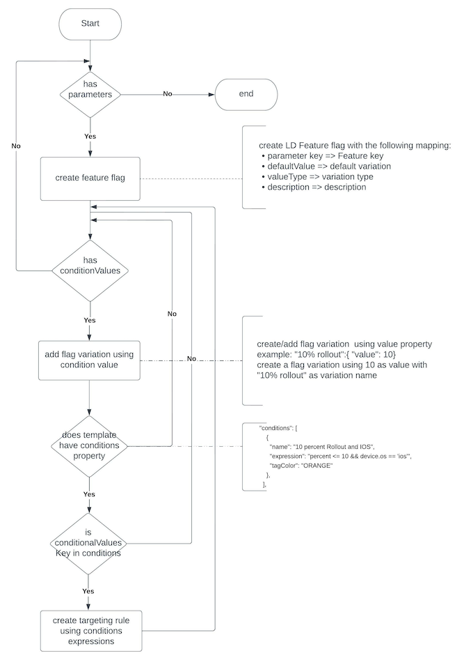

# Firebase Remote Config to LaunchDarkly Migration Tool

This tool assists in migrating from Firebase Remote Config to LaunchDarkly by generating LaunchDarkly feature flag configurations from your existing Remote Config template.

## Features

- Export Remote Config template
- Generate LaunchDarkly feature flag configurations from the Remote Config template


## Terms
| Firebase Remote Config |  LaunchDarkly |
|--|--|
| Parameter | Feature flag |
| Conditions , Expression | Targeting rules , Conditions|
| Parameter Group | Tags, Prerequisites|

*Grouping parameters is only for management purposes and does not affect client-side fetching of parameter values.*


## Migration Decision tree

*Migration Flow diagram*

## Migration checklist
* Identify the application(s), teams and scope of use of Firebase Remote Config in the organization
* Perform an audit of the Firebase Remote Config project to be migrated:
  * project and applications
  * parameter name
  * value type
  * values - i.e., default values, conditional values and in-app default values
  * parameter groups
* Access to Firebase console or a service account private key 

## Limitations

- Currently doesn't support generating LaunchDarkly targeting rules from Remote Config conditions

## Output

- `rctemplate.json`: Remote Config template
- `ldflagconfig.json`: LaunchDarkly flag configurations
- `ldTargetRules.json`: Remote Config conditions mapping to LaunchDarkly flag variations

## Requirements

- Private key file: Google service account ([Generate Private key file](https://firebase.google.com/docs/remote-config/automate-rc#get_an_access_token_to_authenticate_and_authorize_api_requests))
- LaunchDarkly Project ([LaunchDarkly Project](https://docs.launchdarkly.com/home/organize/projects))
- LaunchDarkly Access Token ([LD API Access Token](https://docs.launchdarkly.com/home/account-security/api-access-tokens))
  > **NOTE**: Create a restrictive [custom policy](https://docs.launchdarkly.com/home/members/custom-roles) for flag creation and deletion ONLY to your project.

## Installation

1. Switch to the `firebase-migration` folder and install NPM packages:
   ```
   cd firebase-migration
   npm install
   ```

2. Create an `.env` file and set the following environment variables:
   ```
   GOOGLE_APPLICATION_CREDENTIALS=firebase-adminsdk-yyyy.json
   LD_ACCESS_TOKEN=api-1234-1234-1234
   LD_PROJECT_KEY=firebase-demo
   ```
   Replace the values with the path to your Firebase credentials, LaunchDarkly API access token, and project key.

## Usage

To list available commands, run:
```
npm run
```

### Available Commands

- `npm run createConfigs`: Generate LaunchDarkly flag configs from Firebase Remote Config template
- `npm run createLDConfigs <path-to-rctemplate.json>`: Generate LaunchDarkly flag configs from an existing Firebase Remote Config template
- `npm run createFlags [<path-to-ldflagconfig.json>]`: Create LaunchDarkly feature flags from the generated LD feature flag configuration (default: `output/ldflagconfig.json`)
- `npm run deleteFlags [<path-to-ldflagconfig.json>]`: Delete LaunchDarkly feature flags from the generated LD feature flag configuration (default: `output/ldflagconfig.json`)

Examples:
```
npm run createConfigs
npm run createLDConfigs output/rctemplate.json
npm run createFlags
npm run createFlags output/ldflagconfig.json
npm run deleteFlags
npm run deleteFlags output/ldflagconfig.json
```


## Migration Best Practices

- Prioritize permanent flags for repointing application code from Firebase to LaunchDarkly. Temporary flags will eventually disappear from the code regardless of which system provides them.
- Keep track of migrated flags that still exist in both systems, as pre-migration versions of your application currently in production will remain connected to Firebase for some time. Tagging can be helpful for this purpose.
- New releases of your application will need to connect to both systems until all flags are migrated. While it is possible to do a single cut-over (leaving old versions connected to Firebase and new versions only connected to LaunchDarkly), there is no harm in migrating in phases.
- Set a goal for the number of flags you will re-point to LaunchDarkly in each of your sprints or upcoming production releases while prioritizing permanent flags.

### Consider the following approach for a phased migration:

1. Identify and prioritize permanent flags for migration.
2. In each sprint or production release, re-point a set number of flags from Firebase to LaunchDarkly.
3. Update your application to connect to both Firebase and LaunchDarkly, ensuring that migrated flags are fetched from LaunchDarkly while unmigrated flags continue to be fetched from Firebase.
4. Tag or categorize flags in LaunchDarkly to track their migration status.
5. Monitor the performance and behavior of your application during the migration process to ensure a smooth transition.
6. Once all flags have been migrated, update your application to fetch flags exclusively from LaunchDarkly and remove the Firebase connection.

By following these best practices and adopting a phased approach, you can ensure a successful and manageable migration from Firebase Remote Config to LaunchDarkly.